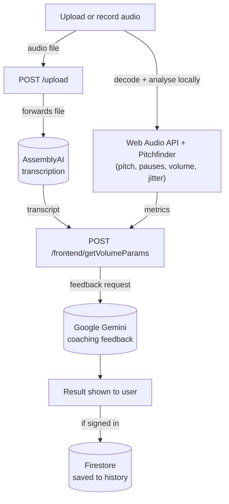

# Volube

**AI-powered speech feedback coach.** Upload an audio clip or record yourself talking, and Volube gives you back a full transcript plus a breakdown of how you actually sound — pace, filler words, pauses, confidence, and a written coaching review.

Live: [volubleai.vercel.app](https://volubleai.vercel.app)

---

## What it does

1. **Upload or record** an audio clip (file upload or in-browser mic recording).
2. The clip is transcribed and analysed for pace, pauses, pitch variation, and volume.
3. An AI coach reviews the transcript + metrics and writes back personalised feedback — filler words, weak words, clarity, repetition, confidence score, and a written summary.
4. **Signed-in users** get every analysis saved to their account and can revisit it later from their history. Signed-out visitors get the full analysis too — it just isn't saved anywhere.

## Tech stack

**Frontend** — React 19, React Router 7, Tailwind CSS, Firebase (Auth + Firestore)

**Backend** — Node.js, Express, Multer (file uploads)

**APIs & libraries**
| | |
|---|---|
| [AssemblyAI](https://www.assemblyai.com/) | Speech-to-text transcription |
| [Google Gemini](https://ai.google.dev/) | Generates the written coaching feedback from the transcript + metrics |
| Web Audio API | Decodes audio client-side and extracts volume, pauses, and live waveform data |
| Media Capture & Streams API (`getUserMedia`, `MediaRecorder`) | In-browser microphone recording |
| [Pitchfinder](https://github.com/peterkhayes/pitchfinder) | Client-side pitch detection (YIN algorithm) used for pitch variation / monotone scoring |
| Firebase Auth | Google sign-in |
| Firebase Firestore | Stores each signed-in user's past analyses |

## How analysis actually works

This is worth knowing if you're reading the code: most of the audio math runs **in the browser**, not on the server.

1. The recorded/uploaded file is sent to the backend, which forwards it to AssemblyAI for transcription and uploads it to get a hosted URL.
2. Meanwhile, the **browser itself** decodes the audio with the Web Audio API, runs Pitchfinder's YIN algorithm frame-by-frame to track pitch, and computes volume (energy) and pause detection directly from the raw samples.
3. Those client-computed metrics, plus the AssemblyAI transcript, get sent to the backend, which calls Gemini to generate the final structured feedback (filler words, clarity, confidence score, written review, etc.).
4. The frontend renders the result and — if you're signed in — saves it to Firestore.



## Project structure

```
voluble/
├── backend/
│   ├── server.js                       # Express app, /upload route (AssemblyAI)
│   ├── controllers/
│   │   ├── assemblyAIController.js      # Submit + poll AssemblyAI transcription jobs
│   │   ├── dataCombiner.js              # Merges transcript + client-side metrics
│   │   └── geminiService.js             # Calls Gemini, returns structured feedback
│   └── Routes/
│       └── volumeParams.js              # /frontend/getVolumeParams route
│
├── frontend/
│   ├── src/
│   │   ├── components/                  # Pages and UI (Dashboard, Navbar, Pricing, etc.)
│   │   │   └── AudioAnalyzer/           # Client-side decode + pitch/pause/volume analysis
│   │   ├── context/AuthContext.jsx      # Firebase auth state (user, sign in/out)
│   │   └── lib/
│   │       ├── firebase.js              # Firebase app/auth/Firestore init
│   │       └── historyService.js        # Firestore reads/writes for past analyses
│   └── package.json
│
└── package.json                          # Root scripts (concurrently runs both)
```

## Running locally

You'll need a `backend/.env` file with your own API keys — these aren't committed, and the app will fail to analyse audio without them.

```
PORT=8080
assembly_apikey=your_assemblyai_api_key
GEMINI_API_KEY=your_gemini_api_key
```

And a `frontend/.env` with your Firebase project config and the backend URL:

```
REACT_APP_API_BASE=http://localhost:8080

REACT_APP_FIREBASE_API_KEY=...
REACT_APP_FIREBASE_AUTH_DOMAIN=...
REACT_APP_FIREBASE_PROJECT_ID=...
REACT_APP_FIREBASE_STORAGE_BUCKET=...
REACT_APP_FIREBASE_MESSAGING_SENDER_ID=...
REACT_APP_FIREBASE_APP_ID=...
```

Then, from the repo root:

```bash
npm install
npm run install-client
npm run dev
```

This starts the backend on `:8080` and the frontend dev server together. Or run them separately:

```bash
npm run server   # backend only
npm run client   # frontend only
```

### Firestore setup

History is written directly from the client via the Firebase SDK, so Firestore needs:

- A composite index on the `analyses` collection: `uid` (ascending) + `createdAt` (descending) — Firestore will prompt you with a direct link to create this the first time the history query runs.
- A security rule restricting each document to its owner, e.g.:
  ```
  match /analyses/{id} {
    allow read: if request.auth.uid == resource.data.uid;
    allow create: if request.auth.uid == request.resource.data.uid;
  }
  ```

## Deployment

- **Frontend** is deployed on Vercel, building from `frontend/`.
- **Backend** is deployed on Render.

Both need their respective environment variables set in their hosting dashboard — local `.env` files are never read in production.

## Credits

Built by [Manan Kasturia](https://github.com/manankasturia) and [Rohit Dangwal](https://github.com/ROHIT-dangwal).

This is a personal/portfolio project — fully free to use, no account tier, no upgrade behind a paywall. If you'd like something custom built, reach out through either GitHub profile or the contact details on the [Pricing](https://volubleai.vercel.app/pricing) page.